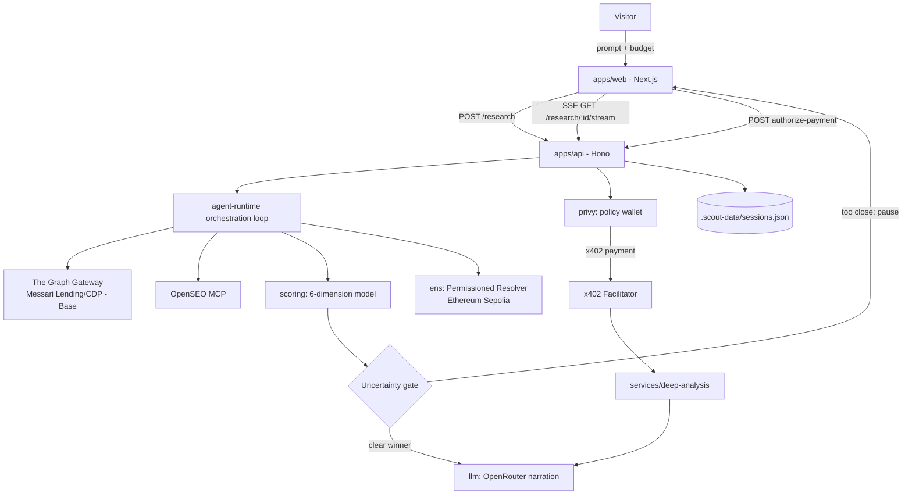

# Scout


**Scout** is an autonomous on-chain research agent. Given a plain-language prompt and a USDC budget, it queries live DeFi lending data from The Graph, enriches it with web/SEO signals from OpenSEO, scores every candidate with a deterministic six-dimension model, and — only when the top two candidates are genuinely too close to call — autonomously spends a small, policy-capped x402 micropayment to buy one more diagnostic report before publishing its final call and status to an ENS identity.

## Table of Contents

- [Overview](#overview)
- [Technology Stack](#technology-stack)
- [Repository Structure](#repository-structure)
- [Architecture](#architecture)
- [API / Service Structure](#api--service-structure)
- [Core Components](#core-components)
- [Prerequisites](#prerequisites)
- [Quick Start](#quick-start)
- [Local Setup](#local-setup)
- [Environment Variables](#environment-variables)
- [Application / Feature Details](#application--feature-details)
- [Database](#database)
- [Authentication & Security](#authentication--security)
- [Integrations](#integrations)
- [Testing](#testing)
- [Deployment](#deployment)
- [Troubleshooting](#troubleshooting)
- [Contributing](#contributing)
- [Code Standards](#code-standards)
- [License](#license)
- [Support](#support)

---

## Overview

On-chain activity and web search demand for a DeFi protocol live in two disconnected systems. Scout closes that gap for a narrow, well-defined question — *which lending market on Base is the best opportunity right now* — by running one reproducible pipeline end to end:

- **Discover** — query standardized Messari Lending/CDP subgraphs across multiple Base protocols through The Graph Gateway, using one shared query template plus a native Aave adapter for 1‑hour trending data.
- **Enrich** — pull keyword, SERP and competitive-gap signals for the same candidates from OpenSEO.
- **Score** — combine both signal sets into a deterministic, evidence-linked six-dimension opportunity score (0–100) plus a separate risk score. No LLM is involved in the scoring math itself.
- **Resolve uncertainty** — if the top two candidates are within a few points of each other or confidence is low, Scout pauses the session (`awaiting_payment`) and asks a human to authorize a small x402 micropayment for one candidate-specific diagnostics report, rather than guessing.
- **Pay autonomously** — once authorized, a policy-controlled Privy server wallet — not the visitor's wallet — signs the x402 payment under a hard-coded budget policy (total cap, per-request cap, recipient allowlist, optional ENS-sourced cap).
- **Narrate** — an OpenRouter chat completion turns the fixed score breakdown into a short recommendation summary (optional; scoring still works without it).
- **Publish** — the final status and report hash are written to an ENSv2 name's text records through a role-gated Permissioned Resolver, so the outcome carries an on-chain, access-controlled identity.

Everything streams to the web UI live over Server-Sent Events, and the entire decision log — including any refused payment or missing evidence — is preserved with the session rather than hidden.

## Technology Stack

### Frontend

| Technology | Version | Purpose |
| --- | --- | --- |
| Next.js | 15.1.3 (App Router) | `apps/web` — research composer, live investigation timeline, reports library, agent identity page |
| React | 19.0.0 | UI rendering |
| Tailwind CSS | 3.4.17 | Styling (neo-brutalist design system, custom CSS tokens in `apps/web/src/styles/tokens.css`) |
| @privy-io/react-auth | 2.0.0 | Optional visitor login (email or wallet) and embedded-wallet creation |
| TypeScript | 5.7.2 | Static typing across the whole monorepo |

### Backend

| Technology | Version | Purpose |
| --- | --- | --- |
| Hono | 4.6.14 | `apps/api` — REST + SSE server |
| @hono/node-server | 1.13.7 | Node HTTP adapter for Hono |
| @modelcontextprotocol/sdk | 1.30.0 | Exposes the research pipeline as an MCP tool at `/mcp` |
| @privy-io/node | 0.34.0 | Server-side Privy wallet + access-token verification |
| @x402/core, @x402/evm, @x402/hono | 2.25.0 | Official x402 payment-required middleware, EVM "exact" scheme, and facilitator client |
| zod | 3.25.76 | Request/response and shared schema validation |
| tsx | 4.19.2 | TypeScript dev runner (`tsx watch`) |

### CLI

| Technology | Purpose |
| --- | --- |
| `apps/agent` (`@scout/agent-cli`, bin `scout-agent`) | Runs one research session headlessly from a terminal, using the same `@scout/agent-runtime` as the API |

### Blockchain / Web3

| Technology | Purpose |
| --- | --- |
| viem | EVM client used by both the ENS and x402 packages (account handling, ABI calls, chain definitions) |
| x402 protocol (`@x402/*`) | HTTP 402 "pay-per-request" middleware and client for the paid diagnostics endpoint |
| Privy server wallets | Policy-enforced signer for the agent's own x402 payments (visitor never pays or connects a wallet) |
| The Graph Gateway | Source of live on-chain lending data (Messari Lending/CDP subgraphs, Base) |
| ENSv2 + Permissioned Resolver | On-chain agent identity (`scout-agent.eth`), text-record status writes, role-bitmap access control (Ethereum Sepolia) |
| Base Sepolia | Network the x402 USDC micropayment actually settles on (chain `eip155:84532`) |

### Infrastructure

| Technology | Purpose |
| --- | --- |
| npm workspaces | Monorepo package management (`apps/*`, `packages/*`, `services/*`) |
| Turborepo 2.3.3 | Task orchestration/caching for `build`, `dev`, `test`, `lint` across workspaces |
| Render (`render.yaml`) | Blueprint deployment of two Node web services (API + web), auto-deploying from `main` |

## Repository Structure

```text
scout/
├── apps/
│   ├── web/                # Next.js 15 dashboard: composer, live SSE timeline, reports, agent identity, pitch deck
│   ├── api/                 # Hono REST + SSE + MCP server; owns research sessions and the x402 payment gate
│   └── agent/                # `scout-agent` CLI — one-shot headless research runs
├── services/
│   └── deep-analysis/        # Library producing the paid, candidate-specific diagnostics report
├── packages/
│   ├── agent-runtime/         # Orchestration loop that wires every provider together into one session
│   ├── schemas/                # Zod schemas shared by every app/package (sessions, candidates, scores, payments)
│   ├── scoring/                 # Deterministic 6-dimension opportunity score, risk score, uncertainty gate
│   ├── graph/                    # The Graph Gateway client — Messari Lending/CDP discovery & queries
│   ├── openseo/                   # OpenSEO MCP client for keyword/SERP enrichment
│   ├── llm/                        # OpenRouter chat-completion client that narrates the final recommendation
│   ├── x402/                        # Raw-private-key x402 payment provider + shared budget policy check
│   ├── privy/                        # Privy server-wallet x402 payment provider (policy-enforced)
│   ├── ens/                           # ENSv2 identity: name resolution, text records, Permissioned Resolver ACL
│   ├── bazantic/                       # Static MCP "recipe" manifest for publishing to a Bazantic gateway
│   └── hedera/                          # Unimplemented Hedera Blocky402 payment-provider stub
├── scripts/                             # One-off provisioning/verification scripts (Privy, ENS, Graph probes)
├── docs/                                 # Architecture, security and partner-integration notes
├── render.yaml                           # Render Blueprint: two-service deployment topology
└── package.json                          # npm workspaces root + Turborepo scripts
```

## Architecture



**Data flow**

1. The visitor submits a prompt and a USDC budget from `apps/web`; `apps/api` creates a session and returns immediately while research runs in the background.
2. `agent-runtime` calls `@scout/graph` to discover and query live Messari Lending/CDP subgraphs on Base, then `@scout/openseo` to enrich the same candidates with search/SERP signals.
3. `@scout/scoring` produces a ranked, evidence-linked score breakdown and evaluates the uncertainty gate (see [Application / Feature Details](#application--feature-details)).
4. If the gate fires, the session status flips to `awaiting_payment` and an SSE event tells the UI to show the payment panel; nothing else proceeds until the visitor authorizes or skips it.
5. On authorization, `@scout/privy` (or the raw-key `@scout/x402` provider) pays `services/deep-analysis` over x402; the settlement transaction reference is required for the payment to be considered successful — there is no simulated fallback.
6. `@scout/llm` asks OpenRouter to turn the fixed score breakdown into a short recommendation narrative (skipped silently if no API key is set).
7. `@scout/ens` resolves `scout-agent.eth` and writes the research status to its text records if `ENS_AGENT_NAME` is configured; every session is persisted to a local JSON file regardless of whether the ENS write succeeds.

## API / Service Structure

All routes are served by `apps/api` (Hono). There is no separate API gateway.

| Method & Path | Purpose |
| --- | --- |
| `GET /` | Service banner with links to `/health` and `/openapi.json` |
| `GET /health` | Health check (used as the Render `healthCheckPath`) |
| `GET /agent/identity` | Resolves the ENS agent identity, permissions, text records and budget cap |
| `POST /agent/test-eac` | Exercises the ENS access-control model with an authorized or a deliberately unauthorized write |
| `GET /research` | Lists research sessions, optionally filtered by `?status=` |
| `POST /research` | Starts a new research session (`request`, `budget`, `chain`, `category`) |
| `GET /research/:id` | Fetches one session's full state |
| `GET /research/:id/stream` | Server-Sent Events stream of the live decision log |
| `POST /research/:id/authorize-payment` | Authorizes the pending x402 payment for deep analysis |
| `POST /research/:id/deny-payment` | Skips the paid diagnostics step and finalizes with existing evidence |
| `POST /api/deep-protocol-analysis` | x402-gated ($0.03 USDC) endpoint that returns candidate-specific diagnostics |
| `GET /api/protocol-opportunity` | Synchronous one-shot research call (used by the MCP tool and Bazantic recipe) |
| `GET /bazantic/recipe` | Static MCP "recipe" manifest for a Bazantic gateway |
| `GET /openapi.json` | OpenAPI 3.1 description of the two research endpoints |
| `ALL /mcp` | Model Context Protocol endpoint exposing `protocol_opportunity_analysis` |

`POST /research`, `POST /research/:id/authorize-payment` and `POST /research/:id/deny-payment` accept an optional `Authorization: Bearer <privy-access-token>` header; it is verified server-side only when `PRIVY_REQUIRE_AUTH=true`.

## Core Components

| Component | Role |
| --- | --- |
| `@scout/agent-runtime` | Runs the full research loop (`runResearch`, `authorizePaymentAndComplete`, `denyPaymentAndComplete`) and emits every decision-log event |
| `@scout/schemas` | Single source of truth for the `ResearchSession`, `Candidate`, `CandidateScore`, payment and event types (Zod) |
| `@scout/scoring` | `scoreCandidate`, `rankCandidates`, `evaluateUncertaintyGate` — the six-dimension model and its decision thresholds |
| `@scout/graph` | Discovers and queries Messari Lending/CDP subgraph deployments and native trending adapters via the Graph Gateway |
| `@scout/openseo` | Wraps the OpenSEO MCP client for keyword/SERP/competitive enrichment |
| `@scout/llm` | Thin OpenRouter chat-completion client used only to narrate the already-computed result |
| `@scout/x402` | Budget-policy check (`checkBudgetPolicy`) and a raw-private-key x402 payment provider |
| `@scout/privy` | Policy-enforced x402 payment provider backed by a Privy server wallet |
| `@scout/ens` | ENSv2 identity provider: `resolveName`, `getPermissions`, `getBudgetCap`, `writeResearchStatus`, `attemptUnauthorizedWrite` |
| `@scout/bazantic` | Builds the static MCP recipe manifest returned by `/bazantic/recipe` |
| `@scout/hedera` | `HederaBlocky402Provider` — same `PaymentProvider` interface as x402/Privy, always returns `success: false`; scaffolded but not wired into any app |
| `@scout/deep-analysis` | `runDeepAnalysis` — produces the paid candidate-specific diagnostics payload |

## Prerequisites

### Required

- **Node.js** ≥ 20 (root `package.json` `engines.node`)
- **npm** ≥ 10 (repo is pinned to `npm@10.9.0` via `packageManager`)
- A **The Graph** Gateway API key (research fails immediately without it)
- An **OpenSEO** API key (research fails immediately without it)

### Optional

- An **OpenRouter** API key — without it, sessions still complete but with no narrated recommendation text
- A **Privy** app (App ID/secret, plus a policy-controlled server wallet ID and policy ID) and a **Base Sepolia** funded wallet — required only to exercise the paid-diagnostics/x402 flow end to end
- An **ENS Sepolia** RPC URL, a registered `ENS_AGENT_NAME`, and an agent wallet — required only to publish research status on-chain
- A **Bazantic** account — the recipe manifest is static and works without any credential; `BAZANTIC_API_KEY` is not read by any current code path

## Quick Start

```bash
# Clone repository
git clone https://github.com/RohitSah23/scout.git

# Enter project
cd scout

# Install dependencies (npm workspaces installs apps/*, packages/*, services/*)
npm install

# Configure environment
cp .env.example .env
# then fill in the keys described in Environment Variables below

# Start the web dashboard (:3000) and API server (:3001) together
npm run dev
```

## Local Setup

### 1. Database / Infrastructure

None to provision. Scout has no database, Docker Compose file or external cache — session state is written to a local `.scout-data/sessions.json` file the first time a session is saved, and the directory is git-ignored.

### 2. Environment Variables

A single `.env` file at the **repository root** is required — `apps/api/src/index.ts` loads it explicitly via `dotenv` using a path relative to its own source file, so per-app `.env` files in `apps/api` are not read. `apps/web` additionally reads any `NEXT_PUBLIC_*` variable through Next.js's own env loading (an `apps/web/.env.local` can override the root value during `next dev`/`next build`).

```env
# required
GRAPH_GATEWAY_API_KEY=your-graph-gateway-key
OPENSEO_API_KEY=your-openseo-key
NEXT_PUBLIC_API_URL=http://localhost:3001

# optional — narration
OPENROUTER_API_KEY=your-openrouter-key

# optional — paid diagnostics over x402
X402_PAY_TO_ADDRESS=0xyourreceivingaddress
PRIVY_WALLET_ID=your-privy-server-wallet-id
PRIVY_POLICY_ID=your-privy-policy-id
NEXT_PUBLIC_PRIVY_APP_ID=your-privy-app-id
PRIVY_APP_SECRET=your-privy-app-secret

# optional — publish status to ENS
ENS_AGENT_NAME=your-agent.eth
ENS_AGENT_PRIVY_WALLET_ID=your-ens-agent-wallet-id
ENS_AGENT_WALLET_ADDRESS=0xyourensagentaddress
```

See [Environment Variables](#environment-variables) below for the full list and [docs/API_KEYS.md](docs/API_KEYS.md) for where to obtain each credential. Never commit a populated `.env` — it is already git-ignored.

### 3. Install Dependencies

```bash
npm install
```

### 4. Database Setup

Not applicable — there is no schema, migration or seed step.

### 5. Start Development Server

```bash
npm run dev        # web (3000) + api (3001) via Turborepo
npm run dev:all    # every workspace's own dev script, in parallel
```

### 6. Standalone CLI

```bash
npm run build -w @scout/agent-cli
node apps/agent/dist/index.js "Rank the top lending assets across Base protocols. $0.50 budget."
```

The CLI shares `@scout/agent-runtime` with the API and reads the same root `.env`.

## Environment Variables

| Variable | Required | Purpose |
| --- | --- | --- |
| `GRAPH_GATEWAY_API_KEY` | Yes | The Graph Gateway key; `runResearch` throws immediately without it |
| `OPENSEO_API_KEY` | Yes | OpenSEO MCP key; `runResearch` throws immediately without it |
| `OPENSEO_PROJECT_ID` | No | Scopes OpenSEO queries to an existing project |
| `NEXT_PUBLIC_API_URL` | Yes (web) | Base URL `apps/web` calls for every API request |
| `OPENROUTER_API_KEY` | No | Enables narrated recommendations; silently skipped if absent |
| `OPENROUTER_MODEL` | No | Chat-completion model id (default `anthropic/claude-3.5-sonnet`) |
| `OPENROUTER_BASE_URL` | No | OpenAI-compatible endpoint override (default `https://openrouter.ai/api/v1`) |
| `OPENROUTER_SITE_URL` / `OPENROUTER_SITE_NAME` | No | Sent as `HTTP-Referer` / `X-Title` to OpenRouter |
| `X402_PAY_TO_ADDRESS` | For paid diagnostics | Recipient of the $0.03 USDC payment; also required to enable the `/api/deep-protocol-analysis` 402 middleware at all |
| `X402_FACILITATOR_URL` | No | x402 facilitator (default `https://x402.org/facilitator`) |
| `X402_FACILITATOR_API_KEY_ID` / `X402_FACILITATOR_API_KEY_SECRET` | No | Only needed for an authenticated production facilitator — the public testnet facilitator needs no key |
| `X402_PRIVATE_KEY` | No | Raw EVM private key for the non-Privy `X402PaymentProvider` path |
| `BASE_SEPOLIA_RPC_URL` | No | Default `https://sepolia.base.org` |
| `NEXT_PUBLIC_PRIVY_APP_ID` / `PRIVY_APP_SECRET` | For paid diagnostics | Privy app credentials, used by both the web login and the API's server wallet |
| `PRIVY_WALLET_ID` / `PRIVY_POLICY_ID` | For paid diagnostics | The policy-controlled wallet that actually signs the x402 payment |
| `PRIVY_REQUIRE_AUTH` | No | When `"true"`, `/research*` routes require a verified Privy access token |
| `ENS_SEPOLIA_RPC_URL` | No | Default `https://ethereum-sepolia-rpc.publicnode.com` |
| `ENS_AGENT_NAME` | No, but load-bearing once set | When set, every session resolves this name and **requires** a usable agent wallet below, or the run fails |
| `ENS_AGENT_PRIVY_WALLET_ID` / `ENS_AGENT_WALLET_ADDRESS` | Required once `ENS_AGENT_NAME` is set | Wallet that signs ENS text-record writes (or use `ENS_AGENT_PRIVATE_KEY` instead) |
| `ENS_AGENT_PRIVATE_KEY` | No | Local-key fallback for the agent wallet above |
| `ENS_UNAUTHORIZED_PRIVY_WALLET_ID` / `ENS_UNAUTHORIZED_WALLET_ADDRESS` / `ENS_UNAUTHORIZED_PRIVATE_KEY` | No | Only used by `/agent/test-eac`'s unauthorized-write demo |
| `ENS_OWNER_PRIVY_WALLET_ID` / `ENS_OWNER_WALLET_ADDRESS` / `ENS_DEPLOYER_PRIVATE_KEY` / `ENS_PARENT_NAME` | No | Only used by the one-off scripts in `scripts/` |
| `ENS_PERMISSIONED_RESOLVER_ADDRESS` | No | Not currently read by any code path in the repository |
| `BAZANTIC_API_KEY` | No | Not currently read by any code path in the repository — the recipe manifest is static |
| `API_PORT` | No | Local dev port for `apps/api` (default `3001`); Render supplies `PORT` itself in production |
| `PUBLIC_API_URL` | No | Used to build the self-referential OpenAPI server URL and the Bazantic recipe endpoint |
| `DEEP_ANALYSIS_URL` | No | Default `http://127.0.0.1:<port>/api/deep-protocol-analysis` |

## Application / Feature Details

### Research Composer & Live Investigation (`/`, `/research/new`, `/research/[id]`)

A visitor types a prompt and a USDC budget; the UI streams the resulting decision log live over SSE — subgraph discovery, OpenSEO enrichment, provisional scores, the uncertainty-gate verdict, payment authorization, and the final recommendation — alongside an evidence drawer for the raw candidate data.

### Reports Library (`/reports`)

Lists every past session via `GET /research`, including its winner, composite score, confidence and spend.

### Agent Identity (`/agent`)

Calls `GET /agent/identity` to show the resolved ENS name, its granted text-record permissions, current records and on-chain budget cap, and offers the authorized-vs-unauthorized EAC write test described below.

### Pitch Deck (`/pitch-deck`)

A static in-app slide deck (`components/pitch/PitchDeck.tsx`) used for presenting the project; not part of the research pipeline.

### The Uncertainty Gate and the six-dimension score

`@scout/scoring` weights six evidence dimensions into one composite (0–100): `onchainGrowth` (0.3), `userGrowth` (0.2), `searchDemand` (0.2), `competitiveGap` (0.15), `seoOpportunity` (0.1), `evidenceConfidence` (0.05). A separate risk score is computed independently. The gate pays for one more diagnostics report only when the top two candidates are within 5 points of each other **or** confidence is below 70, provided the remaining budget covers the $0.03 price and that pair hasn't already been paid for; a lead of more than 10 points with confidence ≥ 75 is treated as a clear winner and no payment is requested.

### Blockchain

- **Networks**: Base (mainnet, read-only) for live lending-market data; Base Sepolia (testnet, `eip155:84532`) for the actual x402 USDC settlement; Ethereum Sepolia (testnet) for the ENSv2 identity and resolver.
- **Contracts**: no contracts are deployed by this repository. It writes to an existing ENS **Permissioned Resolver** (`setText`, `multicall`, `roles`, `hasRootRoles`) and reads standard Messari Lending/CDP subgraph schemas.
- **Wallets**: Privy-managed server wallets, bridged to `viem` accounts via `@privy-io/node`'s `createViemAccount` — one for the payment policy, one for ENS writes (each falls back to a raw local private key if configured instead).
- **Tokens/transactions**: USDC only, moved via the x402 "exact" EVM scheme (EIP-3009-style authorization), capped at $0.10 per request and $0.03 per deep-analysis purchase; every payment requires a verifiable settlement transaction reference or it is treated as a failure — there is no simulated receipt path.

## Database

Scout has no relational or document database. `apps/api/src/store.ts` persists every `ResearchSession` as a JSON value inside a single `.scout-data/sessions.json` file (created on first write, git-ignored), plus one bundled `verified-session.json` shipped with the API so a known-good demo session survives an ephemeral filesystem. There is no ORM and no migration system — the shape of the data is enforced entirely by the `ResearchSessionSchema` Zod schema in `@scout/schemas`.

## Authentication & Security

- **No traditional accounts.** Visitor login is optional and handled by `@privy-io/react-auth` in `apps/web` (email or wallet, with an embedded wallet auto-created on first login).
- **Server-side verification is opt-in.** `apps/api` only checks the visitor's Privy access token (`PrivyClient.utils().auth().verifyAccessToken`) when `PRIVY_REQUIRE_AUTH=true`; otherwise `/research*` routes are open.
- **The visitor never pays.** All x402 spending is signed by a separate, policy-controlled Privy server wallet — never the visitor's own wallet or session.
- **Spending policy** (`@scout/x402`'s `checkBudgetPolicy`, enforced before every payment): a total session budget, a hard $0.10 per-request cap, a recipient allowlist, and — when `ENS_AGENT_NAME` is set — an additional cap read live from the ENS `research.budget` text record.
- **ENS access control.** The agent wallet holds only a scoped `ROLE_SET_TEXT` bit for specific text-record resources on the Permissioned Resolver; only the separately-held owner wallet can transfer the name or change the resolver. `POST /agent/test-eac` exercises both an authorized write and a deliberately unauthorized one so the access-control revert is visible, not just asserted.
- **No secrets in the client.** Only `NEXT_PUBLIC_*` variables (the Privy app ID and the API base URL) are exposed to the browser; every private key, app secret and wallet ID stays server-side.

## Integrations

| Service | Why it's used | Where |
| --- | --- | --- |
| **The Graph** | Load-bearing source of live on-chain lending data — research fails closed if it can't be reached. Queries standardized Messari Lending/CDP subgraph deployments through the Graph Gateway, plus one native Aave adapter for 1‑hour trending data. | `packages/graph` |
| **OpenSEO** | Load-bearing source of search/SERP/competitive signal for the same candidates, via OpenSEO's MCP endpoint. | `packages/openseo` |
| **x402** | HTTP-402 "pay-per-request" protocol for the paid diagnostics endpoint. The official `@x402/hono` middleware plus an `HTTPFacilitatorClient` verify and settle payments against a configurable facilitator (defaults to the public testnet facilitator, no key required). | `apps/api`, `packages/x402` |
| **Privy** | Provides both the optional visitor login and the policy-controlled server wallet that actually signs x402 payments; a wallet is refused at pay-time if it doesn't enforce the expected policy ID. | `apps/web/src/app/providers.tsx`, `packages/privy` |
| **ENSv2** | On-chain agent identity (`ENS_AGENT_NAME`) with status/budget text records behind a role-gated Permissioned Resolver. | `packages/ens` |
| **OpenRouter** | Optional OpenAI-compatible chat-completion call that narrates the already-computed score breakdown into readable text. | `packages/llm` |
| **Bazantic** | Static MCP "recipe" manifest describing how to import Scout's research tool into a Bazantic gateway; marked `"status": "integration-template"` — no credential is currently read for it. | `packages/bazantic` |
| **Hedera (Blocky402)** | Scaffolded alternative `PaymentProvider` for a Hedera-based x402 facilitator; not implemented and not wired into any app (`pay()` always returns `success: false`). | `packages/hedera` |

## Testing

Only `@scout/scoring` currently ships automated tests:

```bash
npm run test -w @scout/scoring   # vitest run
npm run test                      # turbo run test — runs every workspace's test script (only scoring defines one)
```

No end-to-end or load tests are configured in the repository.

## Deployment

Deployment is defined entirely by [`render.yaml`](render.yaml) — a Render Blueprint with two Node web services, both on the free plan in the Oregon region, building with `npm ci --include=dev && npm run build` and auto-deploying on every push to `main`:

| Service | Start command | Health check |
| --- | --- | --- |
| `scout-api-ethglobal-2026` | `npm run start -w @scout/api` | `/health` |
| `scout-web-ethglobal-2026` | `npm run start -w @scout/web -- --hostname 0.0.0.0 --port $PORT` | `/` |

A handful of env vars are given literal values directly in `render.yaml` (e.g. `ENS_AGENT_NAME`, `X402_FACILITATOR_URL`); the rest are marked `sync: false` and must be entered manually in the Render dashboard for each service — they are **not** populated from the repository or from a local `.env`. There is no Dockerfile and no CI/CD pipeline configured (no `.github/workflows`); Render's own build step is the only automated check before a deploy.

## Troubleshooting

- **`GRAPH_GATEWAY_API_KEY is required...` / `OPENSEO_API_KEY is required...`** — both are hard requirements checked at the start of every research run. Confirm a single `.env` exists at the **repository root** (not inside `apps/api`) and restart the dev server after editing it.
- **`authorize-payment` returns 500 with `ENS agent wallet is required...`** — happens whenever `ENS_AGENT_NAME` is set but neither `ENS_AGENT_PRIVY_WALLET_ID` + `ENS_AGENT_WALLET_ADDRESS` nor `ENS_AGENT_PRIVATE_KEY` resolve to a usable account. Either provide a valid agent wallet or unset `ENS_AGENT_NAME` to disable ENS entirely for local development.
- **`/api/deep-protocol-analysis` returns 503 `x402 pay-to address is not configured`** — `X402_PAY_TO_ADDRESS` is missing or isn't a valid `0x` + 40-hex-character address.
- **Payment authorization fails with a Privy policy error** — `PrivyX402PaymentProvider` refuses to pay if the configured `PRIVY_WALLET_ID` doesn't have `PRIVY_POLICY_ID` attached in the Privy dashboard.
- **401 Unauthorized on `/research*` routes** — set `PRIVY_REQUIRE_AUTH=false` for local development, or send a valid Privy access token from a logged-in web session.
- **Port already in use** — `apps/api` defaults to `3001` (override with `API_PORT`), `apps/web` defaults to `3000` (`next dev -p 3000`).
- **A workspace package's types aren't found during build** — run `npm run build` from the repository root so Turborepo builds dependency packages (e.g. `@scout/schemas`) before the apps that import them, rather than building an individual app in isolation.

## Contributing

1. Fork the repository and clone your fork.
2. `npm install` at the repository root.
3. Create a feature branch off `main`.
4. Make your changes; build the affected workspace(s) with `npm run build` (or `npm run build -w <package>`).
5. Run `npm run test` — currently exercises `@scout/scoring`'s suite.
6. Open a pull request describing the change and its motivation.

## Code Standards

- **TypeScript everywhere**, compiled with a shared `tsconfig.base.json`: `strict: true`, ES2022 target, `NodeNext` module resolution.
- Every package is an ES module (`"type": "module"`) built with `tsc` to `dist/`.
- The root `package.json` defines a `lint` script (`turbo run lint`), but no individual workspace currently declares its own `lint` script or ESLint/Prettier configuration — linting is not currently enforced.

## License

No license has been specified yet.

## Support

- **Issues**: use the repository's GitHub Issues tracker.
- **Documentation**: [docs/ARCHITECTURE.md](docs/ARCHITECTURE.md), [docs/SECURITY.md](docs/SECURITY.md), [docs/PARTNERS.md](docs/PARTNERS.md), [docs/API_KEYS.md](docs/API_KEYS.md) (credential setup), [docs/DEMO.md](docs/DEMO.md).

No Discord, email or other support channel is documented in the repository.
