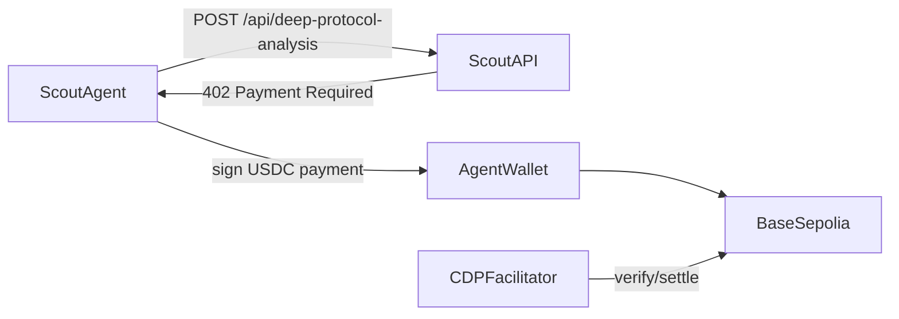

# Where to Get All Scout API Keys

Scout requires **live API credentials** for research data (The Graph, OpenSEO, OpenRouter). Missing keys cause the research run to fail with a clear error — there are no silent mock fallbacks for on-chain or SEO evidence. **x402**, **Privy payments**, and **ENS** fail closed until live wallet and resolver configuration is supplied.

## Quick priority

| Priority | Keys | Why |
|----------|------|-----|
| **Start here** | `OPENROUTER_API_KEY` | Powers LLM narration; without it you get template text |
| **Live data** | `GRAPH_GATEWAY_API_KEY`, `OPENSEO_API_KEY` | Real subgraph + SEO data instead of mocks |
| **Wallet UX** | `NEXT_PUBLIC_PRIVY_APP_ID` | Enables Privy login in the web app |
| **Payments (optional)** | `X402_*`, `ENS_*` private keys | Only needed for real on-chain flows |
| **External setup** | Bazantic account, Privy wallet/policy, ENSv2 name/resolver | Required to turn the implemented integrations into verifiable prize evidence |

---

## 1. LLM — OpenRouter

**Vars:** `OPENROUTER_API_KEY`, `OPENROUTER_MODEL`, `OPENROUTER_BASE_URL`, `OPENROUTER_SITE_URL`, `OPENROUTER_SITE_NAME`

| Variable | Where to get it |
|----------|-----------------|
| `OPENROUTER_API_KEY` | [openrouter.ai/settings/keys](https://openrouter.ai/settings/keys) — sign up, create an API key |
| Others | Defaults in `.env.example` are fine; only change `OPENROUTER_MODEL` if you want a different model |

**Used by:** `packages/llm/src/openrouter.ts` — returns `null` and falls back to template narrative if missing.

---

## 2. The Graph

**Var:** `GRAPH_GATEWAY_API_KEY`

| Step | Action |
|------|--------|
| 1 | Go to [thegraph.com/studio](https://thegraph.com/studio/) |
| 2 | Connect wallet |
| 3 | Sidebar → **API Keys** → **Create API Key** |
| 4 | Copy key into `GRAPH_GATEWAY_API_KEY` |

**Docs:** [Managing API keys](https://thegraph.com/docs/en/subgraphs/providers/subgraph-studio/managing-api-keys/)

**Used by:** `packages/graph/src/index.ts` — queries `https://gateway.thegraph.com/api/<KEY>/subgraphs/id/...`. Without a key, research fails.

**Note:** Subgraph MCP at `https://subgraphs.mcp.thegraph.com/sse` can also use this same key as `Authorization: Bearer <KEY>` (see [PARTNERS.md](./PARTNERS.md)).

---

## 3. OpenSEO

**Var:** `OPENSEO_API_KEY`

| Step | Action |
|------|--------|
| 1 | Sign up at [app.openseo.so](https://app.openseo.so) |
| 2 | **Settings → API keys** → create key |
| 3 | Copy key (format: `oseo_...`) — shown only once |

**Docs:** [openseo.so/docs/mcp](https://openseo.so/docs/mcp)

**Optional:** `OPENSEO_PROJECT_ID` — if omitted, Scout uses the first project from `list_projects`.

**Used by:** `packages/openseo/src/index.ts` — calls OpenSEO MCP tools `research_keywords` and `get_serp_results` via `https://app.openseo.so/mcp`. Without a key, research fails.

---

## 4. x402 / Base Sepolia

**Vars:** `X402_PAY_TO_ADDRESS`, `X402_FACILITATOR_API_KEY_ID`, `X402_FACILITATOR_API_KEY_SECRET`, `X402_PRIVATE_KEY`, `BASE_SEPOLIA_RPC_URL`



| Variable | Where to get it |
|----------|-----------------|
| `X402_PAY_TO_ADDRESS` | Your own wallet address that receives USDC micropayments (e.g. from MetaMask on Base Sepolia) |
| `X402_PRIVATE_KEY` | Private key of the **agent/payer** wallet (export from MetaMask or generate a new test wallet). Fund it with Base Sepolia USDC for real payments |
| `X402_FACILITATOR_API_KEY_ID` / `X402_FACILITATOR_API_KEY_SECRET` | [Coinbase Developer Platform (CDP)](https://portal.cdp.coinbase.com/) → create API key → copy **API Key ID** and **API Key Secret**. These map to CDP's `CDP_API_KEY_ID` / `CDP_API_KEY_SECRET` for the x402 facilitator |
| `BASE_SEPOLIA_RPC_URL` | Default `https://sepolia.base.org` works; or use [Alchemy](https://www.alchemy.com/) / [Infura](https://infura.io/) for a dedicated RPC URL |

**CDP docs:** [x402 CDP Facilitator](https://docs.cdp.coinbase.com/x402/seller/facilitator)

**Used by:** `packages/x402/src/index.ts` rejects payments when its signing key is missing or invalid. The production agent path uses the policy-controlled Privy wallet. `apps/api/src/index.ts` uses `X402_PAY_TO_ADDRESS` and `X402_FACILITATOR_URL` for the deep-analysis 402 endpoint. The public testnet facilitator needs no API key; use an authenticated production facilitator or self-hosted facilitator for mainnet.

**Testnet USDC:** Use Base Sepolia faucet / bridge; Scout's deep analysis costs **$0.03 USDC** per call.

---

## 5. Privy

**Vars:** `NEXT_PUBLIC_PRIVY_APP_ID`, `PRIVY_APP_SECRET`, `PRIVY_WALLET_ID`, `PRIVY_POLICY_ID`, `PRIVY_REQUIRE_AUTH`

| Step | Action |
|------|--------|
| 1 | Sign up at [dashboard.privy.io](https://dashboard.privy.io) |
| 2 | **New app** → name it (e.g. "Scout Dev") |
| 3 | **Configuration → App settings → Basics** |
| 4 | Copy **App ID** → `NEXT_PUBLIC_PRIVY_APP_ID` |
| 5 | Copy **App Secret** → `PRIVY_APP_SECRET` (shown once at creation; regenerate if lost) |

**Docs:** [Create new app](https://docs.privy.io/basics/get-started/dashboard/create-new-app)

**Used by:** `apps/web/src/app/providers.tsx` only reads `NEXT_PUBLIC_PRIVY_APP_ID`. The API verifies Privy access tokens when `PRIVY_REQUIRE_AUTH=true`. `PRIVY_APP_SECRET`, `PRIVY_WALLET_ID`, and `PRIVY_POLICY_ID` also power the policy-controlled x402 payer.

---

## 6. ENSv2 Sepolia

**Vars:** `ENS_SEPOLIA_RPC_URL`, `ENS_AGENT_PRIVATE_KEY`, `ENS_AGENT_NAME`, `ENS_PERMISSIONED_RESOLVER_ADDRESS`, `ENS_UNAUTHORIZED_PRIVATE_KEY`

| Variable | Where to get it |
|----------|-----------------|
| `ENS_SEPOLIA_RPC_URL` | Default `https://rpc.sepolia.org` works; or use Alchemy/Infura Sepolia RPC |
| `ENS_DEPLOYER_PRIVATE_KEY` | Private key of a wallet with Sepolia ETH (for registering parent names) |
| `ENS_AGENT_PRIVATE_KEY` | Private key of the agent's wallet (for writing research status records) |
| `ENS_PARENT_NAME` | An ENS name you own on Sepolia (e.g. `scout.eth`) — register at [Sepolia ENS App](https://sepolia.app.ens.domains) |

**Docs:** [ENSv2 overview](https://docs.ens.domains/ensv2/overview), [App developers tutorial](https://docs.ens.domains/ensv2/tutorial-app-developers/)

**Used by:** `packages/ens/src/index.ts` — performs direct Sepolia resolver reads/writes and returns an explicit configuration error when required values are missing. You do **not** deploy ENS protocol contracts yourself; they are already on Sepolia.

**Sepolia ETH:** Use any Sepolia faucet. Registration fees on Sepolia use free `MockUSDC` (mintable on-chain).

---

## 7. Bazantic

**Var:** `BAZANTIC_API_KEY`

| Step | Action |
|------|--------|
| 1 | Go to [bazantic.com](https://bazantic.com/) |
| 2 | Install CLI: `npm i -g bazantic-cli` |
| 3 | Run `bazantic login` (browser device-code flow) |
| 4 | Create gateway: `bazantic gateway add --spec-url ... --endpoint ...` |

**Docs:** [bazantic-cli on npm](https://www.npmjs.com/package/bazantic-cli)

**Note:** Bazantic uses a **CLI session token** (stored in `~/.bazantic/config.json`), not a simple API key env var. `BAZANTIC_API_KEY` is in `.env.example` but **is not read by the codebase yet**. Scout already exposes a recipe manifest at `GET /bazantic/recipe` via `packages/bazantic`.

---

## 8. API server (no signup)

**Vars:** `API_PORT`, `NEXT_PUBLIC_API_URL`

These are local config only — no external signup. Defaults (`3001` / `http://localhost:3001`) work for local dev.

---

## Minimal `.env` to get started

For local development with the best experience without on-chain setup:

```env
OPENROUTER_API_KEY=sk-or-...
GRAPH_GATEWAY_API_KEY=...
OPENSEO_API_KEY=oseo_...
NEXT_PUBLIC_PRIVY_APP_ID=...
```

Leaving x402/ENS blank disables those live features with explicit errors; Scout never fabricates their evidence. Graph, OpenSEO, and OpenRouter keys are required for research.

---

## Security reminders

- Copy `.env.example` to `.env` (never commit `.env`)
- Never put private keys (`X402_PRIVATE_KEY`, `ENS_*_PRIVATE_KEY`, `PRIVY_APP_SECRET`) in frontend env vars
- Only `NEXT_PUBLIC_*` vars are exposed to the browser
